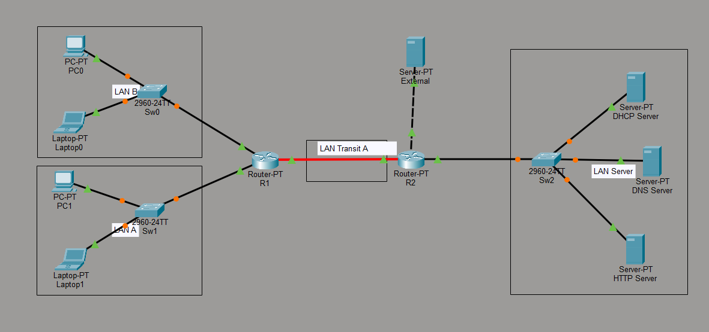
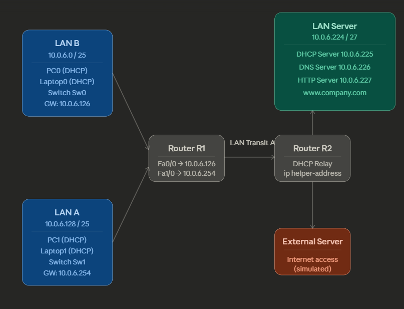

# MultiLAN Network Simulation — Cisco Packet Tracer

**Academic Project | Computer Networks(CN)**  
**ISEL – Instituto Superior de Engenharia de Lisboa**  
**Course: Engenharia Informática e Multimédia | 2024/2025**

> **Authors:** João Póvoa (nº 51392)
---

## Table of Contents

- [Project Overview](#-project-overview)
- [Network Topology](#-network-topology)
- [Project Phases](#-project-phases)
- [IP Addressing Plan](#-ip-addressing-plan)
- [Services Deployed](#-services-deployed)
- [How to Open and Run](#-how-to-open-and-run)
- [Requirements](#-requirements)
- [File Structure](#-file-structure)
- [Key Concepts Covered](#-key-concepts-covered)

---

##  Project Overview

This project builds a **complete corporate network from scratch** using Cisco Packet Tracer, developed across four progressive phases. It covers LAN configuration, inter-network routing, subnetting, and the deployment of essential network services (DHCP, DNS, HTTP).

The final result is a fully functional simulated network where clients across multiple LANs automatically receive IP configurations via DHCP, resolve domain names via DNS, and access a web server by name (`http://www.company.com`).

---

##  Network Topology





**Summary of segments:**

| Segment | Network | Mask | Gateway |
|---|---|---|---|
| LAN A (clients) | 10.0.6.128/25 | 255.255.255.128 | 10.0.6.254 |
| LAN B (clients) | 10.0.6.0/25 | 255.255.255.128 | 10.0.6.126 |
| LAN Transit A | connects R1 ↔ R2 | — | — |
| LAN Server | 10.0.6.224/27 | 255.255.255.224 | — |

---

##  Project Phases

### Phase 1 — Web Server & TCP/IP Client
Installation and configuration of a web server, plus development of a custom web client to communicate over TCP/IP.

### Phase 2 — Connecting Devices (LAN A and LAN B)
- Configured LAN A with static IPs (Laptop0: `10.0.6.1`, PC0: `10.0.6.2`)
- Applied **/25 subnetting** to split the `10.0.6.0/24` block into two equal subnets
- Configured Router R1 with two FastEthernet interfaces (one per LAN)
- Validated connectivity with `ping` between all devices across LANs
- Verified routing table with `show ip route`

### Phase 3 — Multi-LAN Routing
- Expanded the topology with Router R2 and a transit network
- Added the Server LAN (DHCP, DNS, HTTP servers)
- Configured inter-router routing through LAN Transit A
- Connected an external server

### Phase 4 — Deploy Services
- **DHCP Server** (`10.0.6.225`): Three address pools (LAN_A, LAN_B, serverPool), clients receive IP automatically
- **DNS Server** (`10.0.6.226`): A-record mapping `www.company.com` → `10.0.6.227`
- **HTTP Server** (`10.0.6.227`): Serves `index.html` over HTTP (port 80) and HTTPS (port 443)
- **DHCP Relay Agent**: Configured on R1 and R2 with `ip helper-address 10.0.6.225` so clients in all LANs reach the centralised DHCP server
- Tested full end-to-end: `nslookup www.company.com` + browser access from PC0, PC1, Laptop0, Laptop1
- Demonstrated ARP table behaviour (empty → populated after ping → cleared after interface reset)

---

##  IP Addressing Plan

### Client Devices (receive IP via DHCP)

| Device | LAN | IP Assigned | Subnet Mask | Gateway |
|---|---|---|---|---|
| PC1 | LAN A | 10.0.6.1 | 255.255.255.128 | 10.0.6.126 |
| Laptop1 | LAN A | 10.0.6.2 | 255.255.255.128 | 10.0.6.126 |
| Laptop0 | LAN B | 10.0.6.129 | 255.255.255.192 | 10.0.6.190 |
| PC0 | LAN B | 10.0.6.130 | 255.255.255.192 | 10.0.6.190 |

### Server Devices (static IPs)

| Device | IP | Subnet Mask |
|---|---|---|
| DHCP Server | 10.0.6.225 | 255.255.255.224 |
| DNS Server | 10.0.6.226 | 255.255.255.224 |
| HTTP Server | 10.0.6.227 | 255.255.255.224 |

### Router Interfaces

| Interface | Connected To | IP |
|---|---|---|
| R1 FastEthernet0/0 | LAN B | 10.0.6.126 |
| R1 FastEthernet1/0 | LAN A | 10.0.6.254 |

---

##  Services Deployed

### DHCP
- Protocol: DORA (Discover → Offer → Request → Acknowledge)
- Three pools configured: `LAN_A`, `LAN_B`, `serverPool`
- Relay Agent (`ip helper-address`) configured on each router interface so broadcasts reach the centralised server across subnets

### DNS
- Translates `www.company.com` to `10.0.6.227`
- Type A record configured in Packet Tracer DNS service

### HTTP / HTTPS
- Web server serves a Welcome page at `http://www.company.com`
- HTTP active on port 80, HTTPS on port 443
- Pages available: `index.html`, `helloworld.html`, `image.html`, `copyrights.html`

---

##  How to Open and Run

### Prerequisites

1. Install **Cisco Packet Tracer** (version 8.x recommended)  
   → Download at [netacad.com](https://www.netacad.com) (free with a Cisco NetAcad account)

### Open the Project

1. Clone or download this repository
2. Open Cisco Packet Tracer
3. Go to **File → Open** and select the `.pka` file from this repository
4. The full network topology will load automatically

### Test the Network

Once open, you can verify the network is working:

**Test DHCP** — click on any PC/Laptop → Desktop tab → IP Configuration → set to DHCP and confirm an IP is assigned automatically.

**Test DNS + Connectivity** — click on any PC → Desktop → Command Prompt:
```
nslookup www.company.com
ping www.company.com
```

**Test Web Access** — click on any PC → Desktop → Web Browser → type:
```
http://www.company.com
```
The Cisco Packet Tracer welcome page should load.

**Inspect Routing Table** — click on Router R1 → CLI tab:
```
show ip route
```

**Inspect ARP Table** — click on any device → Desktop → Command Prompt:
```
arp -a
```

---

##  Requirements

| Tool | Version | Purpose |
|---|---|---|
| Cisco Packet Tracer | 8.x | Open and simulate the `.pka` file |
| Cisco NetAcad account | Free | Required to download Packet Tracer |

> No additional software or programming environment is needed. Everything runs inside Packet Tracer.

---

##  File Structure

```
MultiLan_Network_Simulation/
├── README.md                          # This file
├── computer-networks_TP.pka           # Main Packet Tracer project file
├── reports/
│   ├── Relatorio_Phase2.pdf           # Phase 2 report (LAN setup & subnetting)
│   └── Relatorio_Phase4.pdf           # Phase 4 report (DHCP, DNS, HTTP services)
└── .gitattributes                     # Git LFS tracking for .pka files
```

> The `.pka` file is tracked via **Git LFS** due to its size (~33 MB). Make sure Git LFS is installed before cloning: `git lfs install`

---

##  Key Concepts Covered

| Concept | Description |
|---|---|
| **Subnetting** | Dividing `10.0.6.0/24` into /25 and /27 subnets for logical network separation |
| **Static Routing** | Manually configured routes between LANs via Router R1 and R2 |
| **DHCP** | Dynamic IP assignment across multiple subnets using relay agents |
| **DNS** | Domain name resolution mapping `www.company.com` to a server IP |
| **HTTP/HTTPS** | Web server serving pages over standard ports 80 and 443 |
| **ARP** | Address Resolution Protocol — mapping IPs to MAC addresses |
| **DHCP Relay Agent** | `ip helper-address` enabling cross-subnet DHCP communication |
| **Default Gateway** | Router interface acting as the exit point for each LAN |

---

##  References

- Kurose, J. F.; Ross, K. W. (2021). *Computer Networking: A Top-Down Approach* (8th ed.). Pearson.
- Cisco Systems. *Cisco Packet Tracer*, version 8.2. San Jose, CA: Cisco Systems, 2023.
- Course slides: Chapter 4 – Network Layer; Chapter 5 – Link Layer. ISEL, 2025.

---

*Academic project developed for the Computer Networks and Internet course at ISEL, semester 2024/2025.*
